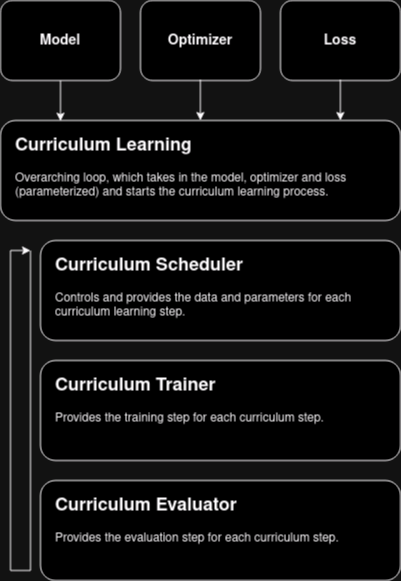

# Physical Informed Neural Networks (PINNs) for Solving Partial Differential Equations (PDEs)

This repository contains example for PINN with curriculum learning for solving PDEs. The code is based on the paper [Krishnapriyan, Aditi, et al. "Characterizing possible failure modes in physics-informed neural networks." Advances in Neural Information Processing Systems 34 (2021): 26548-26560.](https://proceedings.neurips.cc/paper/2021/file/df438e5206f31600e6ae4af72f2725f1-Paper.pdf) ([Archive Link](https://arxiv.org/abs/2109.01050))

## Overview

# Curriculum Learning implementation

# To Do

## Implementation

- [x] Technological stack (e.g. Weights & Biases, PyTorch Lightning, etc.)? -> W&B
- [x] Project structure (e.g. `src`, `data`, `notebooks`, `reports`, `references`, `tests`, `docs`, etc. In `src`: `models`, `data`, `utils`, etc., But highly depends on the project goals)
- [x] Experimental setup (e.g. similar to the paper?)
- [x] Implementation of curriculum learning
- [x] Visualization of results (e.g. prediction and ground truth for $u(x, t)$, other metrics (wandb logging))
  - [x] Logging during training loop of curriculum learning is tricky with W&B. Find a clever way to do it.
- [x] YAML config file for training
- [x] Shuffle?
- [x] Figure out closure for `torch.optim.LBFGS`
- [x] Seeding? (e.g. `torch.manual_seed(n)`)
- [x] Baseline implementation (i.e. PINN without curriculum learning)
- [x] Stopping criterion (e.g. early stopping, etc.)
- [x] Small improvements
  - [x] save path
  - [x] Better CLI Logging of run
  - [x] Documentation Code (e.g. doc-strings, comments, etc.)
  - [x] More Epochs
  - [x] Keep track of early stopping epochs
  - [ ] Assertion tests (e.g. `assert x.shape == y.shape`)
  - [ ] (??) instead of stopping less than exact lowest loss, use some tolerance (e.g. 1e-3) to adjust for noise in the loss
- [ ] Documentation (e.g. `README.md`, `requirements.txt`, `setup.py`, `LICENSE`, etc.)
- [ ] Sweep over hyperparameters (e.g. learning rate, batch size, etc.)
  - [ ] Need to move all inits to intialize function of the learner and keep it out of the training loop
  - [x] Adjust wand.init to not init for sweeps
  - [x] Ref. https://docs.wandb.ai/guides/sweeps/walkthrough
  - [ ] Does scheduler work with sweeps?

## Experiments

- [x] Add SGD optimizer
- [x] First run:
  - [x] Test with small epoch, if everything works
  - [x] First initial large run with Optimizer LBFGS, SGD, Adam in Baseline and Curriculum Learning Mode 
- [ ] What are good experiments to run?
- [ ] Maybe adjust loss module (sth different than MSE)
  - [ ] Regularization term of the PDE loss; different $\lambda$'s (currently 1), as PDE loss is significantly lower than MSE loss
  - [ ] why is the MSE loss always close to 1 at later stages of training? -> maybe guides the training towards uniform solution instead of the periodic one 

## Other

- [x] Project description (e.g. what is the goal of the project? what Milestones are there? What metrics should be used?)

- [x] Question regarding paper
  - [x] Equation (4) in paper: If $L_{u_b}$ and $L_{u_0}$ measure initial and boundary conditions, do we not miss some other NN measures, as we only rely on the PDE loss? (e.g. MSE for some $u(x)$ or something like that?) Yes, should include some Loss for different $u(x, t)$ as well.
  - [x] Figure 1: Is it fitting the boundary conditions? Yes, but if this is meaningful behavior is questionable.
  - [x] Their description of the convection problem is actually the convection-diffusion problem without diffusion and a constant velocity field. Hence $\beta$ describes the velocity in this case and the higher $\beta$ the higher the velocity. Is this correct? Yes.
  - [x] The Loss described in equation (7) for the convection problem is MSE + reg. PDE term + Boundary term. What exactly do they mean with $u^i_0$ Is it the initial loss as in (4)? See first question.

- [ ] Report
  - [ ] Structure, content, etc. 
